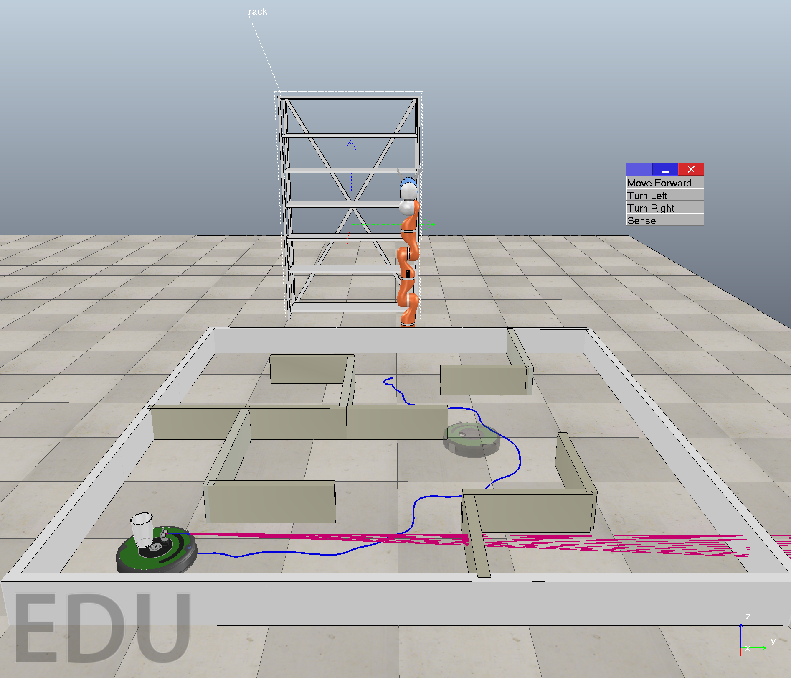
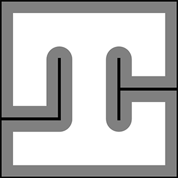
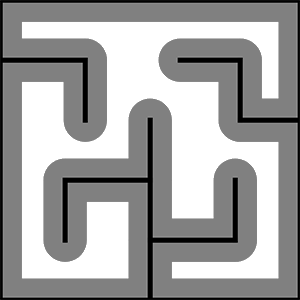

# CSCI445 Introduction to Robotics Final Project
## Note: We recommend rendering this README for readability.
## Introduction
This project requires a iRobot roomba robot to do localization using Particle Filter, plan a path to a pre-defined goal using Rapidly Exploring Random Tree (RRT) algorithm, and go to the goal. Then a robot arm would grab a cup loaded on the iRobot roomba, and place it on 4 different levels of a shelf.



## Configuration Space
There are two different configuration spaces, a simple one and a complex one.

 

We have two different entry points in the program for these two configuration spaces. `finalproject_01.py` for the simple one, and `finalproject_02.py` for the complex one.

## Required Packages
`requirement.txt` contains all packages required to run this project. To ensure that the project runs without errors, we recommend using [anaconda](https://www.anaconda.com/) to create new virtual environment by running:
```bash
conda create -n 445finalproject_yulun_shihong_zhaohang python=3.7
```
And then run the following to install all required packages.
```bash
pip install -r requirement.txt
```

## Run our code
To run the code in the simple configuration space (shown above), run the following:
```bash
python run.py --sim finalproject_01.py
```

To run the code in the complex configuration space (shown above), run the following:
```bash
python run.py --sim finalproject_02.py
```

## Change which level to put the cup on the shelf
The level is hardcoded, and is defaulted to be level0.
### Simple configuration space
Change **line 253** of `finalproject_01.py` to one of the following functions:
```python
self.kinematics.go_to_level0(self.arm)
self.kinematics.go_to_level1(self.arm)
self.kinematics.go_to_level2(self.arm)
self.kinematics.go_to_level3(self.arm)
```
### Complex configuration space
Change **line 247** of `finalproject_02.py` to one of the following functions:
```python
self.kinematics.go_to_level0(self.arm, map_idx = 2)
self.kinematics.go_to_level1(self.arm, map_idx = 2)
self.kinematics.go_to_level2(self.arm, map_idx = 2)
self.kinematics.go_to_level3(self.arm, map_idx = 2)
```

## Answer Videos
Even though we have tried our best to minimize the randomness in our code, due to the unstable and probabilistic nature of Particle Filter and RRT algorithms, the result of the your running might vary a little. Therefore, under the `ans` folder, we have included some videos to demonstrate the correctness of our implementation.

We have one video for each configuration space and each shelf. `ans/simple` contains the videos for simple configuration space, and `ans/complex` contains the videos for complex configuration space.